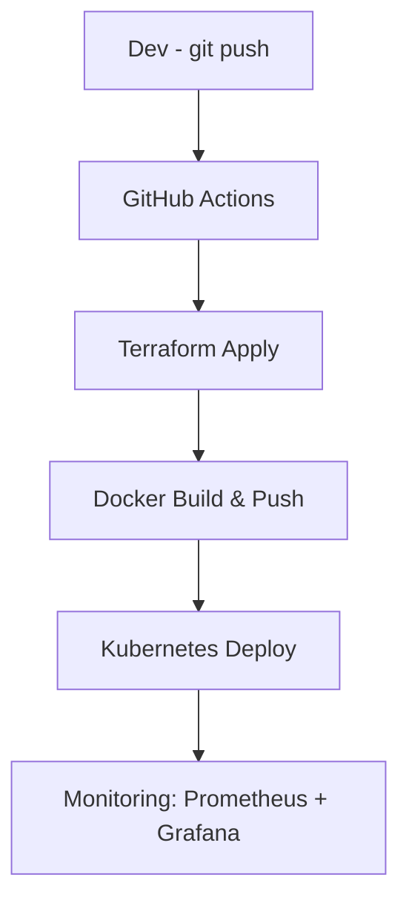

# 👋 Hello, I’m Amin | DevOps Engineer 👨‍💻☁️

```bash
> Automating infrastructure, deploying microservices, and monitoring the cloud ☁️
> Current Location: Netherlands 🇳🇱 | Looking for visa-sponsored DevOps roles 💼

🔧 Tech Stack
Languages:
  - JavaScript
  - TypeScript
  - Bash
  - Python

Tools & Platforms:
  - Docker & Kubernetes
  - AWS (Lambda, EC2, S3)
  - Terraform & Ansible
  - GitHub Actions, Jenkins
  - Prometheus, Grafana, ELK

🚀 Highlight Projects
| Project                                         | Description                                                       | Tools                   |
| ----------------------------------------------- | ----------------------------------------------------------------- | ----------------------- |
| [💳 Payment Transaction Simulator](https://...) | Microservices-based app simulating payment flow, deployed on AWS. | Node.js, Docker, Lambda |
| [📟 Incident Log Tracker](https://...)          | Web app to track NOC incidents & downtime logs.                   | Express, MongoDB        |
| [🔍 Error Search Tool](https://...)             | Real-time error trace analyzer for transaction systems.           | ElasticSearch, Node.js  |


📘 My Articles

How I Became a DevOps Engineer

My Daily Workflow as a Cloud Developer

Managing Time as a Self-Taught Techie


📬 Let’s Connect
[Linkedin](https://www.linkedin.com/in/mohammad-amin-amini)

📊 GitHub Activity
```bash
> GitHub Contributions - DevOps style!

My CI/CD Pipeline Diagram
git push → GitHub Actions → Terraform apply → Docker build → K8s deploy → Monitoring


