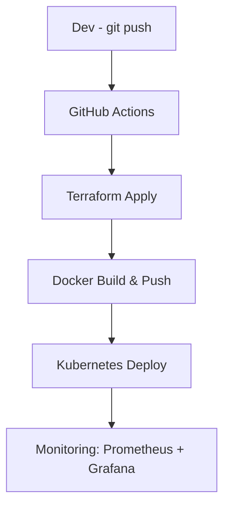

# 👋 Hello, I’m Amin | DevOps Engineer 👨‍💻☁️

<div align="center">
  
</div>

```bash
> Automating infrastructure, deploying microservices, and monitoring the cloud ☁️
> Current Location: Netherlands 🇳🇱 💼
```

<h2 align="left">:hammer_and_wrench: Technologies and Tools I use:</h2>

<!-- DevOps Tools -->
<p align="left">
  <a href="https://www.terraform.io/" target="_blank">
    
  </a>
  <a href="https://aws.amazon.com/" target="_blank">
    
  </a>
  <a href="https://kubernetes.io/" target="_blank">
    
  </a>
  <a href="https://www.ansible.com/" target="_blank">
    
  </a>
  <a href="https://about.gitlab.com/" target="_blank">
    
  </a>
  <a href="https://www.jenkins.io/" target="_blank">
    
  </a>
</p>

<!-- Containers & Version Control -->
<p align="left">
  <a href="https://www.docker.com/" target="_blank">
    
  </a>
  <a href="https://git-scm.com/" target="_blank">
    
  </a>
</p>

<!-- Programming Languages -->
<p align="left">
  <a href="https://nodejs.org/" target="_blank">
    
  </a>
  <a href="https://www.python.org/" target="_blank">
    
  </a>
  <a href="https://www.javascript.com/" target="_blank">
    
  </a>
  <a href="https://typescriptlang.org" target="_blank">
    
  </a>
</p>

<!-- Databases -->
<p align="left">
  <a href="https://www.microsoft.com/en-us/sql-server/" target="_blank">
    
  </a>
  <a href="https://www.oracle.com/database/" target="_blank">
    
  </a>
</p>

<!-- API & Testing -->
<p align="left">
  <a href="https://www.postman.com/" target="_blank">
    
  </a>
</p>

<!-- Logging & Monitoring -->
<p align="left">
  <a href="https://www.zabbix.com/" target="_blank">
    
  </a>
  <a href="https://prometheus.io/" target="_blank">
    
  </a>
  <a href="https://grafana.com/" target="_blank">
    
  </a>
  <a href="https://www.elastic.co/what-is/elk-stack" target="_blank">
    
  </a>
</p>

<h2 align="left">📌 My Projects</h2>

<table>
  <tr>
    <td width="50%">
      <h3>💳 Payment Transaction Simulator</h3>
      <ul>
        <li>🔧 Built with: Node.js, Express, AWS Lambda, Terraform, Docker</li>
        <li>📦 Simulates ISO 8583 transaction flows end-to-end</li>
        <li>📈 Designed for testing payment integrations with webhook support</li>
        <li>🌐 <a href="https://transaction-simulator-frontend-roolpho0.s3-website-us-east-1.amazonaws.com/" target="_blank">Live Demo</a> | <a href="https://github.com/4Min4m/TransactionSimulator" target="_blank">Repo</a></li>
      </ul>
    </td>
    <td>
      
    </td>
  </tr>

  <tr>
    <td width="50%">
      <h3>🛠️ DevOps Training App</h3>
      <ul>
        <li>📦 Full-stack app with React frontend, Node.js backend, and MySQL database</li>
        <li>🔁 GitLab CI/CD pipeline, Docker, Kubernetes</li>
        <li>🗂️ Automated with Ansible & deployed via Terraform</li>
        <li>📘 <a href="https://github.com/4Min4m/3tier-app" target="_blank">Repo</a></li>
      </ul>
    </td>
    <td>
      
    </td>
  </tr>
  
  <tr>
    <td width="50%">
      <h3>🛒 Sabzlife E-commerce App</h3>
      <ul>
        <li>⚡ Fast & Optimized with Vite, Scalable Architecture using React & TypeScript, Modern Styling with TailwindCSS, State Management powered by Redux Toolkit</li>
        <li>⚙️ Payment integration, cart system, admin dashboard</li>
        <li>🚀 Beautiful UI using Lucide-react Icons</li>
        <li>🌐 <a href="https://sabzlife.netlify.app/" target="_blank">Live Demo</a> | <a href="https://github.com/4Min4m/GreenThumb" target="_blank">Repo</a></li>
      </ul>
    </td>
    <td>
      
    </td>
  </tr>

  <tr>
    <td width="50%">
      <h3>🕷️ Spider Mouse Game</h3>
      <ul>
        <li>🎮 Fun interactive animation with pure JavaScript</li>
        <li>🧠 Dynamic particle system</li>
        <li>👾 Spiders chase the mouse cursor in real time</li>
        <li>🌐 <a href="https://spidercurs.netlify.app/" target="_blank">Play Online</a> | <a href="https://github.com/4Min4m/spider-cursor" target="_blank">Repo</a></li>
      </ul>
    </td>
    <td>
      
    </td>
  </tr>
    <tr>
    <td width="50%">
      <h3> 🧾💸 BudgeTrack! </h3>
      <ul>
        <li>🎮 Upload receipts and extract data using Tesseract.js (OCR), Automatically detect & translate Dutch 🇳🇱 and English 🇬🇧 receipts</li>
        <li>🧠 Set budgets across categories and track your spending, Create and manage shopping lists</li>
        <li>👾 Export data to Excel (XLSX), Financial insights with spending charts</li>
        <li>🌐 <a href="https://budgetracki.netlify.app/" target="_blank">Happy budgeting!</a> | <a href="https://github.com/4Min4m/BudgeTrack" target="_blank">Repo</a></li>
      </ul>
    </td>
    <td>
      
    </td>
  </tr>
</table>


📘 My Articles

How I Became a DevOps Engineer

My Daily Workflow as a Cloud Developer

Managing Time as a Self-Taught Techie


📬 Let’s Connect
[Linkedin](https://www.linkedin.com/in/mohammad-amin-amini)

📊 GitHub Activity
```bash
> GitHub Contributions - DevOps style!
```

My CI/CD Pipeline Diagram
git push → GitHub Actions → Terraform apply → Docker build → K8s deploy → Monitoring


