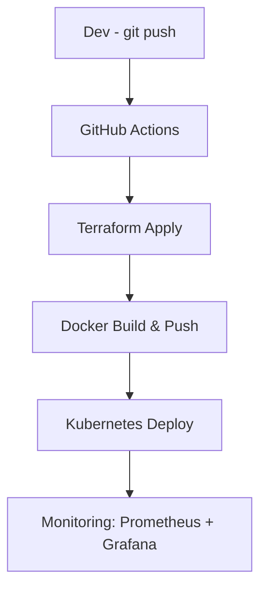

# 👋 Hello, I’m Amin | DevOps Engineer 👨‍💻☁️

<div align="center">
  
</div>

```bash
> Automating infrastructure, deploying microservices, and monitoring the cloud ☁️
> Current Location: Netherlands 🇳🇱 💼
```

<h2 align="left">:hammer_and_wrench: Technologies and Tools I use:</h2>

<!-- DevOps Tools -->
<p align="left">
  <a href="https://www.terraform.io/" target="_blank">
    
  </a>
  <a href="https://aws.amazon.com/" target="_blank">
    
  </a>
  <a href="https://kubernetes.io/" target="_blank">
    
  </a>
  <a href="https://www.ansible.com/" target="_blank">
    
  </a>
  <a href="https://about.gitlab.com/" target="_blank">
    
  </a>
  <a href="https://www.jenkins.io/" target="_blank">
    
  </a>
</p>

<!-- Containers & Version Control -->
<p align="left">
  <a href="https://www.docker.com/" target="_blank">
    
  </a>
  <a href="https://git-scm.com/" target="_blank">
    
  </a>
</p>

<!-- Programming & Backend -->
<p align="left">
  <a href="https://nodejs.org/" target="_blank">
    
  </a>
  <a href="https://expressjs.com/" target="_blank">
    
  </a>
  <a href="https://www.javascript.com/" target="_blank">
    
  </a>
  <a href="https://typescriptlang.org" target="_blank">
    
  </a>
</p>

<!-- Databases & APIs -->
<p align="left">
  <a href="https://www.mongodb.com/" target="_blank">
    
  </a>
  <a href="https://www.postman.com/" target="_blank">
    
  </a>
</p>

<!-- Cloud & Hosting -->
<p align="left">
  <a href="https://azure.microsoft.com/" target="_blank">
    
  </a>
  <a href="https://cloud.google.com/" target="_blank">
    
  </a>
</p>


🚀 Highlight Projects
| Project                                         | Description                                                       | Tools                   |
| ----------------------------------------------- | ----------------------------------------------------------------- | ----------------------- |
| [💳 Payment Transaction Simulator](https://...) | Microservices-based app simulating payment flow, deployed on AWS. | Node.js, Docker, Lambda |
| [📟 Incident Log Tracker](https://...)          | Web app to track NOC incidents & downtime logs.                   | Express, MongoDB        |
| [🔍 Error Search Tool](https://...)             | Real-time error trace analyzer for transaction systems.           | ElasticSearch, Node.js  |


📘 My Articles

How I Became a DevOps Engineer

My Daily Workflow as a Cloud Developer

Managing Time as a Self-Taught Techie


📬 Let’s Connect
[Linkedin](https://www.linkedin.com/in/mohammad-amin-amini)

📊 GitHub Activity
```bash
> GitHub Contributions - DevOps style!
```

My CI/CD Pipeline Diagram
git push → GitHub Actions → Terraform apply → Docker build → K8s deploy → Monitoring


