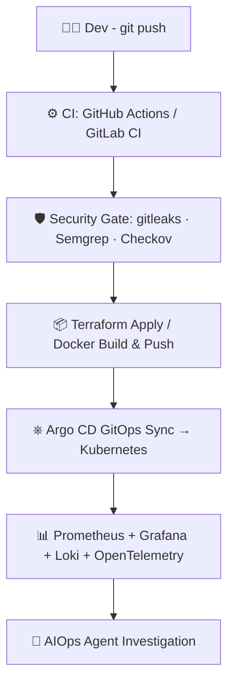

# 👋 Hello, I'm Amin | Cloud & Platform Engineer 👨‍💻☁️

<div align="center">
  
</div>

```bash
> Building production-grade platforms on AWS, Azure & GCP ☁️
> Kubernetes • GitOps • IaC • DevSecOps • AIOps
> Current Location: Netherlands 🇳🇱 💼
```

<h2 align="left">:hammer_and_wrench: Technologies and Tools I use:</h2>

<!-- Cloud Platforms -->
<p align="left">
  <a href="https://aws.amazon.com/" target="_blank">
    
  </a>
  <a href="https://azure.microsoft.com/" target="_blank">
    
  </a>
  <a href="https://cloud.google.com/" target="_blank">
    
  </a>
</p>

<!-- IaC & CI/CD -->
<p align="left">
  <a href="https://www.terraform.io/" target="_blank">
    
  </a>
  <a href="https://www.ansible.com/" target="_blank">
    
  </a>
  <a href="https://about.gitlab.com/" target="_blank">
    
  </a>
  <a href="https://www.jenkins.io/" target="_blank">
    
  </a>
  <a href="https://github.com/features/actions" target="_blank">
    
  </a>
  <a href="https://argo-cd.readthedocs.io/" target="_blank">
    
  </a>
</p>

<!-- Containers & Orchestration -->
<p align="left">
  <a href="https://kubernetes.io/" target="_blank">
    
  </a>
  <a href="https://www.docker.com/" target="_blank">
    
  </a>
  <a href="https://helm.sh/" target="_blank">
    
  </a>
  <a href="https://www.openshift.com/" target="_blank">
    
  </a>
</p>

<!-- Observability -->
<p align="left">
  <a href="https://prometheus.io/" target="_blank">
    
  </a>
  <a href="https://grafana.com/" target="_blank">
    
  </a>
  <a href="https://grafana.com/oss/loki/" target="_blank">
    
  </a>
  <a href="https://opentelemetry.io/" target="_blank">
    
  </a>
  <a href="https://www.elastic.co/what-is/elk-stack" target="_blank">
    
  </a>
  <a href="https://www.zabbix.com/" target="_blank">
    
  </a>
</p>

<!-- Security & Compliance -->
<p align="left">
  <a href="https://www.cncf.io/projects/kyverno/" target="_blank">
    
  </a>
  <a href="https://www.openpolicyagent.org/" target="_blank">
    
  </a>
  <a href="https://semgrep.dev/" target="_blank">
    
  </a>
</p>

<!-- Languages & Scripting -->
<p align="left">
  <a href="https://www.python.org/" target="_blank">
    
  </a>
  <a href="https://www.gnu.org/software/bash/" target="_blank">
    
  </a>
  <a href="https://golang.org/" target="_blank">
    
  </a>
  <a href="https://www.javascript.com/" target="_blank">
    
  </a>
  <a href="https://typescriptlang.org" target="_blank">
    
  </a>
  <a href="https://nodejs.org/" target="_blank">
    
  </a>
</p>

<!-- Databases -->
<p align="left">
  <a href="https://aws.amazon.com/dynamodb/" target="_blank">
    
  </a>
  <a href="https://www.microsoft.com/en-us/sql-server/" target="_blank">
    
  </a>
  <a href="https://www.oracle.com/database/" target="_blank">
    
  </a>
</p>

<!-- AIOps -->
<p align="left">
  <a href="https://langchain-ai.github.io/langgraph/" target="_blank">
    
  </a>
</p>

<h2 align="left">📌 My Projects</h2>

<table>
  <tr>
    <td width="50%">
      <h3>💳 Payment Transaction Simulator (AWS, Serverless)</h3>
      <ul>
        <li>🔧 Built with: AWS Lambda, API Gateway, SQS, DynamoDB, WAFv2, CodeDeploy, Terraform</li>
        <li>💳 Card-payment authorization engine with real ISO 8583 messaging</li>
        <li>🔒 Defense-in-depth: AWS WAFv2, JWT auth, Secrets Manager</li>
        <li>🚀 Canary deployments with auto-rollback; X-Ray tracing; 60+ automated tests</li>
        <li>🌐 <a href="https://4min4m.github.io/TransactionSimulator" target="_blank">Details</a> | <a href="https://github.com/4Min4m/TransactionSimulator" target="_blank">Repo</a></li>
      </ul>
    </td>
    <td>
      
    </td>
  </tr>

  <tr>
    <td width="50%">
      <h3>🏢 Enterprise EKS Platform (AWS)</h3>
      <ul>
        <li>🔧 Built with: EKS, Terraform, Argo CD, Kyverno, Karpenter, KEDA</li>
        <li>🔐 Blocking DevSecOps CI gate: gitleaks, Semgrep, Checkov</li>
        <li>📈 Karpenter autoscaling + KEDA predictive scaling on forecast traffic</li>
        <li>🌍 Multi-region DR with DynamoDB Global Tables and Route 53 failover</li>
        <li>🌐 <a href="https://4min4m.github.io/eks-gate-forecast-dr/" target="_blank">Details</a></li>
      </ul>
    </td>
    <td>
      
    </td>
  </tr>

  <tr>
    <td width="50%">
      <h3>🚀 BidFlow — Internal Developer Platform (GCP)</h3>
      <ul>
        <li>🔧 Built with: GKE Autopilot, Helm, GitHub Actions, Workload Identity Federation</li>
        <li>⚙️ One Helm chart deploys Go & Ruby services with compliance baked in (&lt;3 min)</li>
        <li>🔑 Keyless push-based GitOps — no long-lived service-account keys</li>
        <li>📊 End-to-end tracing: OpenTelemetry + Jaeger; Prometheus-driven HPA</li>
        <li>🌐 <a href="https://4min4m.github.io/BidFlow-Platform-Demo/" target="_blank">Details</a></li>
      </ul>
    </td>
    <td>
      
    </td>
  </tr>

  <tr>
    <td width="50%">
      <h3>🛡️ Zero-Trust AKS Platform (Azure)</h3>
      <ul>
        <li>🔧 Built with: AKS (private), Azure Policy, Gatekeeper, Azure SQL Ledger, Bicep & Terraform</li>
        <li>🔒 No public API server; Azure AD Workload Identity (no static credentials)</li>
        <li>📜 Tamper-evident audit trail mapped to PCI DSS 4.0 Req. 10</li>
        <li>♻️ Identical infrastructure in Bicep and Terraform (IaC parity)</li>
        <li>🌐 <a href="https://4min4m.github.io/azure-aks-zero-trust/" target="_blank">Details</a></li>
      </ul>
    </td>
    <td>
      
    </td>
  </tr>

  <tr>
    <td width="50%">
      <h3>🤖 AIOps Incident-Investigation Agent (Kubernetes)</h3>
      <ul>
        <li>🔧 Built with: LangGraph, Prometheus, Alertmanager, Grafana Alloy, Loki</li>
        <li>⚡ Triggered by alerts; starts investigating before on-call arrives</li>
        <li>🔒 Strictly read-only cluster access</li>
        <li>🔍 Security-audit pipeline tracking RBAC changes and <code>kubectl exec</code></li>
        <li>📈 Agent's own runs instrumented for AI observability</li>
        <li>🌐 <a href="https://4min4m.github.io/eks-aiops-agent-security-audit/" target="_blank">Details</a></li>
      </ul>
    </td>
    <td>
      
    </td>
  </tr>
</table>

---

### 🌐 Find me on:

<p align="left">
  <a href="https://www.linkedin.com/in/mohammad-amin-amini/" target="_blank">
    
  </a>
  <a href="https://medium.com/@m.a.amini2011" target="_blank">
    
  </a>
  <a href="https://www.youtube.com/@aminamshowi" target="_blank">
    
  </a>
  <a href="https://aminam.netlify.app" target="_blank">
    
  </a>
</p>

---

### 📊 GitHub Stats

<p align="left">
  
  
</p>

<p align="center">
  
</p>

My GitOps Delivery Flow
git push → CI Gate (Semgrep/Checkov/gitleaks) → Argo CD → Kubernetes → Observability


```mermaid
graph TD
  A[👨‍💻 Dev - git push] --> B[⚙️ CI: GitHub Actions / GitLab CI]
  B --> C[🛡️ Security Gate: gitleaks · Semgrep · Checkov]
  C --> D[📦 Terraform Apply / Docker Build & Push]
  D --> E[⎈ Argo CD GitOps Sync → Kubernetes]
  E --> F[📊 Prometheus + Grafana + Loki + OpenTelemetry]
  F --> G[🤖 AIOps Agent Investigation]
```
